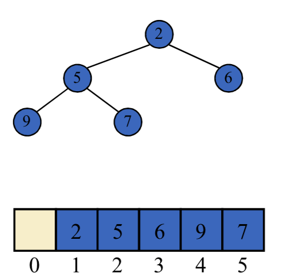
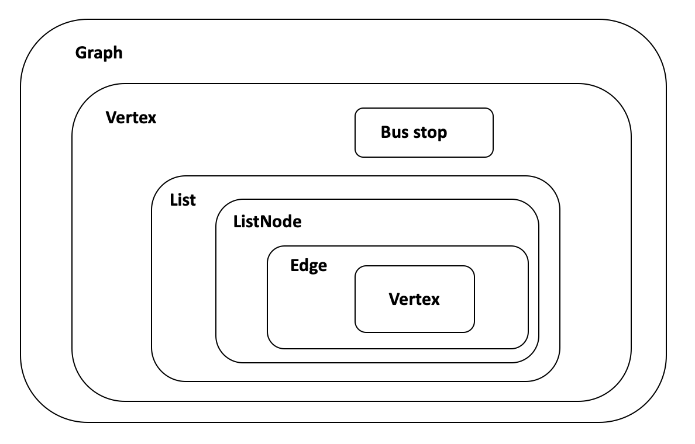
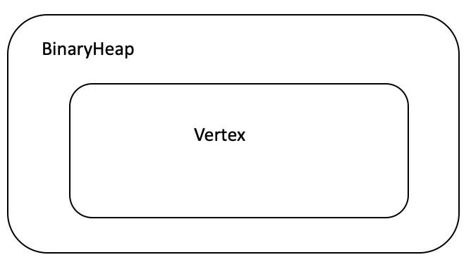

# COMP9024 Assigment 4

This is the design manual of COMP9024 Assignment 4. 

In this assignment, a digraph is used to represent a bus network and several functions are implemented to explore its feature.

## Table of Contents
 - [Data Structures](#data-structures)
   - [Graph Structures](#graph-structures)
   - [List Structures](#list-structures)
   - [Heap Structure](#heap-structure)
 - [Algorithms](#algorithms)
 - [Time Complexity Analysis](#time-complexity-analysis)
 - [Appendix](#appendix)
   - [Structures Dependencies](#structures-dependencies) 

## Data Structures

### Graph Structures 

- ```BusStops```

  This structure stores bus stop names and bus stop serial numbers, according to assignment spec bus stop names are no longer than 20 characters. 

  ```c
  typedef struct bus_stop{
    char name[20];       // bus name is no more than 20 characters
    int id;              // serial number of a bus stop
  }BusStop;
  ```

  Go to [appendix](#appendix) to see its relationship with other structures.

- ```Edge```
  
  An edge links two vertices with a given distance. In this structure we only need to specify the destination vertex and distance, because ```Edge``` is designed to be the subclass of ```vertex``` so the source vertex is just the vertex itself. 
  
  Unfortunately circular dependency exists between ```Edge``` and ```Vertex``` ( they mutually define each other ! ), to resolve this issue it is important to declare : ```struct vertex;``` before we define ```Edge```

  ```c
  struct vertex;          // declare vertex beforehand
  typedef struct edge{ 
    struct vertex *dst;   // destination vertex
    int distance;         // the length of the edge
  }Edge;
  ```

  Go to [appendix](#appendix) to see its relationship with other structures

- ```Vertex```
  
  A vertex must hold information of a bus stop as well as its corresponding edges. In ```Vertex``` we used ```List``` to store edges ( named ```edgesQueue``` ) as well as reversed edges ( named ```reversed_edgesQueue``` ). Reversed edges tell which vertices can reach this vertex and how far they are from this vertex, ```reversed_edgesQueue``` is useful in ```StronglyConnectivity``` where we need to apply dfs reversely. Variables ```distanceFromStartVertex```, ```previousVertexInShortesPath```,```positionInHeap``` are useful in Dijkstra's Algorithm. ```isMark``` is  a book-keeping variable to ensure that in BFS or DFS no vertex is accessed more than once. 

  ```c
  typedef struct vertex{ 
    BusStop *thisBusStop;
    struct list *edgesQueue;
    struct list *reverse_edgesQueue;
    struct vertex *previousVertexInsShortestPath;
    int distanceFromStartVertex;
    int positionInHeap;         // the position of the vertex in binary heap
    int isMarked;
  }Vertex;
  ```

  Go to [appendix](#appendix) to see its relationship with other structures

- ```Graph```
  
  A graph is just a collection of vertices and edges. Since edges are already stored in their corresponding vertice, there's need to explictly declare them in ```Graph``` again. Maximum number of vertices, current number of vertices and edges are saved in ```Graph``` for book-keeping.

  ```c
  typedef struct graphRep{
    Vertex **vertices; // store an array of vertex pointer
    int size;          // max number of vertices that can be store in graph
    int nV;            // number of vertices currently stored in graph
    int nE;            // number of edges currently stored in graph
  }GraphRep;
  typedef GraphRep *Graph;
  ```

  Go to [appendix](#appendix) to see its relationship with other structures

All structures disscussed in this section are defined in ```MyGrap.h``` 

### List Structures

- ```ListNode```
  
  ```List``` is mainly used in storing edges of graph. Hence a ```ListNode``` contains a pointer that points to an edge.
  
  ```c
  typedef struct list_node{
    struct edge *thisEdge;
    struct list_node *next;
  }ListNode;
  ```
  Go to [appendix](#appendix) to see its relationship with other structures

- ```List```
  
  In addtion to the first node of the list, last node of the list is also cached in ```List```, which makes it possible to append a node to ```List``` in O(1) time, regardless of how long the list is.

  ```c
  typedef struct list{
    ListNode *firstNode;
    ListNode *lastNode;
    int size;
  }List;
  ```
  
  Go to [appendix](#appendix) to see its relationship with other structures

All structures disscussed in this section are defined in ```MyList.h```.

### Heap Structure

To implememt Dijkstra's algorithm a heap structure is indispensable. The basic idea is to store every vertex in a heap, ordered by it's distance from the start point. For each run we take the smallest vertex out of the binary heap and compute relaxation until the heap is empty. 

```C
typedef struct binary_heap{
    struct vertex **node;  // the vertex pointers of graph are all stored in an array 
    int n;                 // current number of nodes
    int size;              // total number of nodes 
}BinaryHeap;
```
Inside the binary heap, vetices are store in an array. Below example depicts how an array represents binary heap:

<p align="center">

</p>
Notice that array at position 0 is unused.

Go to [appendix](#appendix) to see its relationship with other structures

## Algorithms
 - Depth-first Search (DFS)
   - used in ```StronglyConnectivity``` to search all bus stops that can be reached 
  
 - Breadth-first Search (BFS)
   - used in ```reachableStops```

 - Kosaraju’s Algorithm
   - used in ```maximalStonglyComponents``` 
  
 - Dijkstra's Algorithm
   - used in ```TravelRoute``` to find shortest path

## Time Complexity Analysis
|        Function name         | Time complexity |
|:-----------------------------|:---------------:|
|```StronglyConnectivity```    | O(M+N)          |
|```maximalStronlyComponents```| O(M+N)          |
|```reachableStops```          | O(M+N)          |
|```TravelRoute```             | O((M+N)*logN)   |


## Appendix
### Structures Dependencies
Diagram below depicts the relationship between different structures, if structure A encloses structure B then structure B is the subclass of structure A (aka, there is a B declared in A). 




